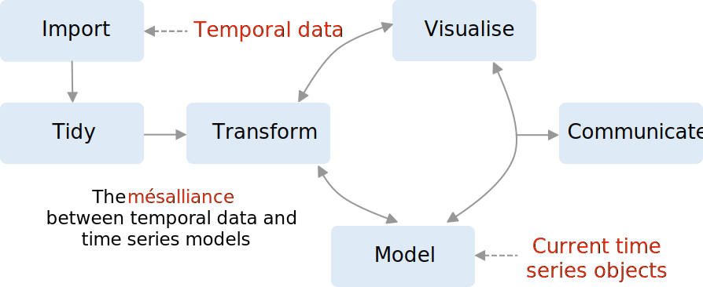

```{r initial, echo = FALSE, cache = FALSE, results = 'hide'}
library(knitr)
options(htmltools.dir.version = FALSE, tibble.width = 60, tibble.print_min = 6)
opts_chunk$set(
  echo = FALSE, warning = FALSE, message = FALSE, comment = "#>",
  fig.path = 'figure/', cache.path = 'cache/', fig.align = 'center', 
  fig.width = 12, fig.show = 'hold', fig.height = 8.5, # 16:9
  cache = TRUE, external = TRUE, dev = 'svglite'
)
read_chunk('R/theme.R')
```

```{r theme-remark}
```

## Today we'll learn

.center[
### 1 unified tidy time series workflow `r emo::ji("bangbang")`
]
<br>

.pull-left[
### 2 packages `r emo::ji("package")`
.center[


]
]
.pull-right[
### 3 big ideas `r emo::ji("bulb")`
1. tsibble
2. mable
3. fable
]

???

I'll explain three big ideas or tibbles both abstractly and concretely with
data examples.

---

## tidy data workflow

.center[

]

The underlying data structure: tibble

---

## current time series workflow

.center[

]

The mésalliance between temporal data and time series models

---

## tidy time series workflow

.center[

]

The underlying data structure: tsibble

---

# AU energy consumption

---
class: inverse middle center

.animated.bounce[

]

## Yet another data standard

---

## Time series has its own semantics

---
class: inverse middle center

.animated.bounce[

]

## Tidy forecasting

---

## Why fable?

> 1. It makes forecasting tables.
> 2. A fable is never true, but it tells you something important about reality.
>
> **Rob J Hyndman**

---

# New generic `model()`


---

## Map and roll

.left-column[
<br>
<br>

]

--

.right-column[
<div style="width:100%;height:0;padding-bottom:64%;position:relative;"><iframe src="https://giphy.com/embed/xoSaxIp8f9JPa" width="100%" height="100%" style="position:absolute" frameBorder="0" class="giphy-embed" allowFullScreen></iframe></div><p><a href="https://giphy.com/gifs/cat-rolls-xoSaxIp8f9JPa"></a></p>
]

---
class: middle center

.card[

[pkg.earo.me/tsibble](https://pkg.earo.me/tsibble)
]
.card[

[github.com/tidyverts/fable](https://github.com/tidyverts/fable)
]
<br>
.card[

[slides.earo.me/rstudioconf19](https://slides.earo.me/rstudioconf19)
]
.card[

[github.com/earowang/rstudioconf19](https://github.com/earowang/rstudioconf19)
]
