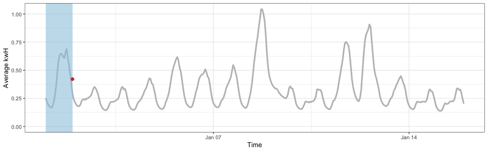

class: middle

```{r initial, echo = FALSE, cache = FALSE, results = 'hide'}
library(knitr)
options(htmltools.dir.version = FALSE, tibble.width = 55, tibble.print_min = 4)
opts_chunk$set(
  echo = FALSE, warning = FALSE, message = FALSE, comment = "#>",
  fig.path = 'figure/', cache.path = 'cache/', fig.align = 'center', 
  fig.width = 12, fig.show = 'hold', fig.height = 8.5, # 16:9
  cache = TRUE, external = TRUE, dev = 'svglite'
)
read_chunk('R/theme.R')
read_chunk('R/main.R')
```

```{r theme-remark}
```

.center[
### 1 tidy unified time series workflow `r emo::ji("bangbang")`
]
<br>

.pull-left[
### 2 packages `r emo::ji("package")`
.center[


]
]
.pull-right[
### 3 big ideas `r emo::ji("bulb")`
1. tsibble
2. mable
3. fable
]

???

I'll explain three big ideas or tibbles both abstractly and concretely with
data examples.

---

## Tidy data workflow

.center[

]

The underlying data structure: [tibble]()

---

## Current time series workflow

.center[

]

The [mésalliance]() between temporal data and time series models

---

## Tidy time series workflow `r emo::ji("smiley")`

.center[

]

The underlying data structure: [tsibble]()

---

# An example: electricity consumption

```{r load}
```

.center[
.card[.large[many series]]
.card[.large[many measurements]]
.card[.large[fine time resolutions]]
]

.footnote[[Data source: Department of the Environment and Energy, Australia](https://data.gov. au/dataset/4e21dea3-9b87-4610-94c7-15a8a77907ef)]

---
class: inverse middle center

.animated.bounce[

]

## A modern reimagining of time series

---

## Time series has its own semantics

```{r coerce, echo = TRUE}
```

1. <i class='far fa-clock'></i> **index**: a variable that represents **time**
2. <i class="fas fa-users"></i> **key**: identifying variables that define **series**
.center[
*.red[1.] + .red[2.] determine distinct rows in a tsibble.*
]

---

## Contextual pretty printing

```{r print, highlight.output = 1:2}
```

.center[
.card[.large[time interval]]
.card[.large[time zone of date-times]]
.card[.large[the number of series]]
]

---

## Look at data early: time gaps

```{r line-na, fig.height = 2.3}
```

```r
elec_ts %>% fill_gaps()
```

```{r fill-gaps, fig.height = 2.3}
```

---

## Implicit missing value handlers

.pull-left[
.div-middle[
1. Check: `has_gaps()`
2. Reveal: `scan_gaps()`
3. Summarise: `count_gaps()`
4. Fill in time gaps: `fill_gaps()`
]
]
.pull-right[
.large[
```r
has_gaps(elec_ts)
```
```{r has-gaps}
```
]
]

---

## A new adjective `index_by()`: time-aware grouping

```{r index-by, echo = TRUE}
```

---

## Functional programming: map and roll

.left-column[
<br>
<br>

]

--

.right-column[
<div style="width:100%;height:0;padding-bottom:64%;position:relative;"><iframe src="https://giphy.com/embed/xoSaxIp8f9JPa" width="100%" height="100%" style="position:absolute" frameBorder="0" class="giphy-embed" allowFullScreen></iframe></div><p><a href="https://giphy.com/gifs/cat-rolls-xoSaxIp8f9JPa"></a></p>
]

---

.pull-left[
slide

tile

stretch

]
.pull-right[
<br>

Type stability suffix: `*_dbl()`, `*_int()`, `*_lgl()`, `*_chr()`

Parallel processing prefix: `future_*`.
]

---

## Rolling averages
.pull-left[
```{r, eval = FALSE, echo = TRUE}
slide_dbl(x, ~ mean(.), 
  .size = 24)
```
.div-middle[
```{r, eval = FALSE, echo = TRUE}
tile_dbl(x, ~ mean(.), 
  .size = 24)
```
]
.div-middle[
```{r, eval = FALSE, echo = TRUE}
stretch_dbl(x, ~ mean(.), 
  .init = 24)
```
]
]
.pull-right[



]

---

## Rolling forecast

```{r eval = FALSE, echo = TRUE}
plan(multiprocess)
expand_forecast <- function(...) {
  # 3 lines of tsibble + fable code ...
}
elec_avg %>% 
  future_pstretch(expand_forecast, .size = 24, .init = 168)
```
.center[

]

---
class: inverse middle center

.animated.bounce[

]

## Tidy forecasting

---

## Why fable?

> 1. It makes forecasting tables.
> 2. A fable is like a forecast: it's never true, but it tells you something important about reality.
>
> **Rob J Hyndman**

---

.left-column[
## The first 30 days
]
.right-column[
```{r split-data}
```

```{r calendar-train}
```
]

---

## .blue[mable]: `model()` the data

```{r model, echo = FALSE, results = "hide"}
```

.small[
```{r, eval = FALSE, echo = TRUE}
elec_mbl <- elec_jan %>% 
  model(
    yesterday = NAIVE(avg_kwh ~ lag("1 day")), 
    ets = ETS(avg_kwh)
  )
```
]

.pull-left[
```
#> # A mable: 1 x 2
#>   yesterday ets         
#>   <model>   <model>     
#> 1 <SNAIVE>  <ETS(M,N,M)>
```
]
.pull-right[
.alert[
1. **succinct model representation**
2. **`summarise()` semantics: reduces rows**
]
]

???

Models are reduced representations of the data down to simplistic structures 
that are described by coefficients.

---

## Inspect mable

1. `tidy()` model parameters
2. `glance()` a one-row per model summary
3. `augment()` with model fits (`.fitted` & `.resid`)
```{r tidy}
```

---

## .blue[fable]: `forecast()` the future

.pull-left[
```{r, eval = FALSE, echo = TRUE}
elec_fbl <- elec_mbl %>% 
  forecast(h = "1 day")
```
]
.pull-right[
.alert[
1. **natural language support**
2. **point forecasts + distribution**
]
]

```{r forecast}
```

---

.left-column[
## Visualise fable .large[`geom_forecast()`]
### - Yesterday
]
.right-column[
```{r vis-naive}
```
]

---

.left-column[
## Visualise fable .large[`geom_forecast()`]
### - Yesterday
### - ETS
]
.right-column[
```{r vis-ets}
```
]

---

## Assess model performance

```{r accuracy, echo = TRUE, error = TRUE}
```

---

## Many model fits at once

```{r subset}
```

```{r batch, echo = TRUE}
```

```{r batch-plot, fig.height = 4.5}
```

???

Models are fundamentally scalable

---

## Much more in the tidyverts

* Decomposition `STL()`
* Simulation `simulate()`
* Interpolation `interpolate()`
* Refitting and streaming `refit()` & `stream()`

---

## Takeaways

.div-middle[
.pull-left[
### 3 tibbles

1. tsibble
2. mable
3. fable
]

.pull-right[
### 3 steps

```{r, eval = FALSE, echo = TRUE}
as_tsibble() %>% 
  model() %>% 
  forecast()
```

Tidy time series workflow
]
]

---

## Joint work

.div-middle[
.center[
.portrait[

Di Cook <br>
<i class='fab fa-twitter' style='color:#6CADDE'></i> [@visnut](http://twitter.com/visnut)
]
.portrait[

Rob J Hyndman <br>
<i class='fab fa-twitter' style='color:#6CADDE'></i> [@robjhyndman](http://twitter.com/robjhyndman)
]
.portrait[

Mitchell O'Hara‑Wild <br>
<i class='fab fa-twitter' style='color:#6CADDE'></i> [@mitchoharawild](http://twitter.com/mitchoharawild)
]
]
]

---
class: middle center

.card[
[.tidyverts[tidyver.orange[ts].org]](http://tidyverts.org)
]
.card[

[pkg.earo.me/tsibble](https://pkg.earo.me/tsibble)
]
.card[

[github.com/tidyverts/fable](https://github.com/tidyverts/fable)
]
<br>
.card[

[slides.earo.me/rstudioconf19](https://slides.earo.me/rstudioconf19)
]
.card[

[github.com/earowang/rstudioconf19](https://github.com/earowang/rstudioconf19)
]
